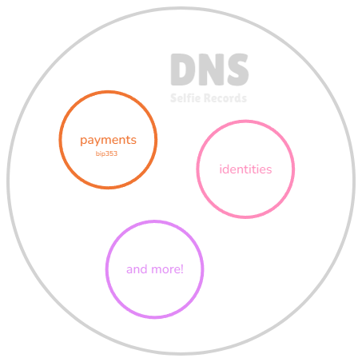

This repository contains two main projects: **Selfie Records SDK** and **Selfie Records Website**. Each project extends the use of DNS TXT records, from SDK-based interactions to visual presentation and documentation on the website.

## Extending BIP353 to Broader Use Cases

<div style="">
  
</div>

### Why expand BIP353 to support more than just Bitcoin payments?

Initially, BIP353 focused solely on payments through DNS TXT records. However, the infrastructure of DNS is versatile and secure, especially when combined with DNSSEC. This project, Selfie Records, aims to expand the utility of BIP353 to support a variety of use cases through TXT records, including:

- **Identities:** Verifying and associating public keys (e.g., Nostr, Bitcoin) with email addresses or domain names.
- **Payments:** Continuing to support Bitcoin payments using DNS-based resolutions.
- **Other data types:** DNS TXT records can store anything from authentication keys to metadata, making it a flexible and decentralized alternative to more traditional data storage methods.

By leveraging the existing DNS infrastructure, we offer a decentralized, secure, and simple solution for handling multiple types of data.


## Projects

### 1. [Selfie Records SDK](./1_package/README.md)

The **Selfie Records SDK** is designed to interact with DNS TXT records, offering a robust solution for storing and retrieving data, extending the concept of Bitcoin Improvement Proposal (BIP) 353 to support a broad range of data types using standard DNS infrastructure.

#### 📚 Key Features:
- Support for various data types via DNS TXT records.
- A robust SDK that simplifies developers' interaction with DNS TXT records.
- Enhanced security with **DNSSEC** to ensure data integrity and authenticity.

#### 🚀 Installation:
```bash
npm i selfie-records
```

#### ⚙️ Usage:
```javascript
import { getRecords } from "selfie-records";

async function fetchRecords() {
  const records = await getRecords({
    name: "hello@miguelmedeiros.dev",
    filters: ["bitcoin-payment", "nostr-key"], // optional
    dnsServer: "1.1.1.1", // optional
  });

  console.log(records);
}

fetchRecords();
```

For more details, check the [SDK README](./1_package/README.md).

### 2. [Selfie Records Website](./2_app/README.md)

The **Selfie Records Website** is the official website built using **Next.js** and **TailwindCSS**. It showcases the interface for interacting with DNS TXT records, highlighting the use of payments, identities, and other data through this technology.

#### 💻 Tech Stack:
- **Next.js**
- **TailwindCSS**

#### 🛠️ Setup and Development:
To run the development server:
```bash
npm run start:dev
```

For more information, see the [Website README](./2_app/README.md).

---

## 📂 Repository Structure

```plaintext
/
├── 1_package/           # Selfie Records SDK
├── 2_app/               # Selfie Records Website
├── docker-compose.yml   # Selfie Records Docker Compose file
└── README.md            # This file
```

Each project has its own detailed README with instructions for installation, usage, and development.

---

## 🐋 Docker Instructions

You can also run the project using Docker. The `docker-compose.yml` file is located at the root of the repository.

To build and run the services, execute the following command from the root directory:

```bash
docker-compose up -d --build
```

This will build and start the containers for both the SDK and the website in detached mode.

To view the logs of the running services:

```bash
docker-compose logs -f
```

To stop the services:

```bash
docker-compose down
```

---

## 📜 License

This repository is open-source under the [MIT License](./LICENSE).

---

## 🤝 Contributing

Contributions are welcome! Please submit pull requests or open issues to suggest improvements or report problems.
